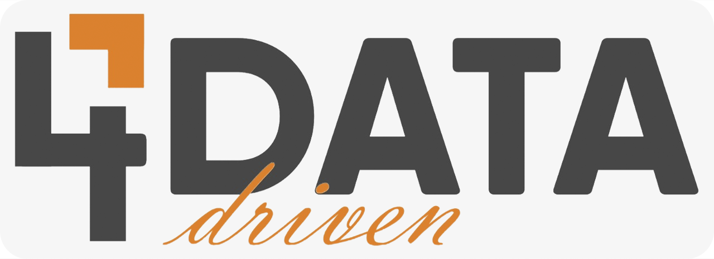
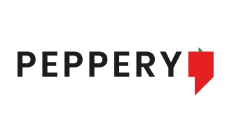

# 4DataDriven 

Soluções customizadas de **_Bi_**, **_Data Analytics_** e **_Data Science_** para Marketing e Vendas

- 4datadriven@4datadriven.com.br
- São Paulo
- (11) 99878-1185

## **O que fazemos**

Atuamos no desenvolvimento de soluções customizadas de **_Business Intelligence_**, **_Data Analytics_** e **_Data Science_** para as áreas de Marketing, Consumer & Market Insights (CMI), Social Media, Paid Media, SAC 2.0, Trade Marketing e Vendas.

## **Clientes**

## **Tecnologias**

Trabalhamos com tecnologias de fornecedores líderes de mercado:

### **Cloud**

 

### **Database**

### **DataViz**

### **Analytics/Science**

